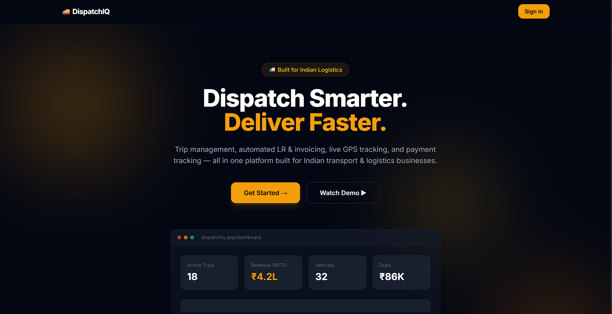
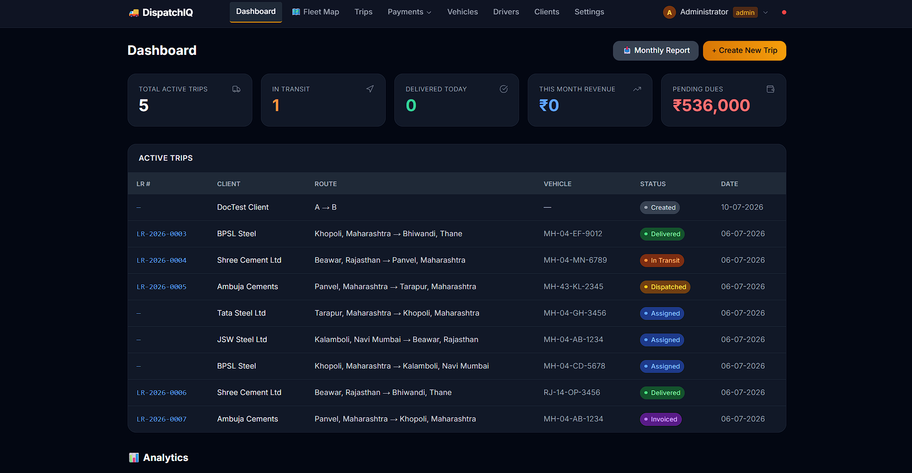
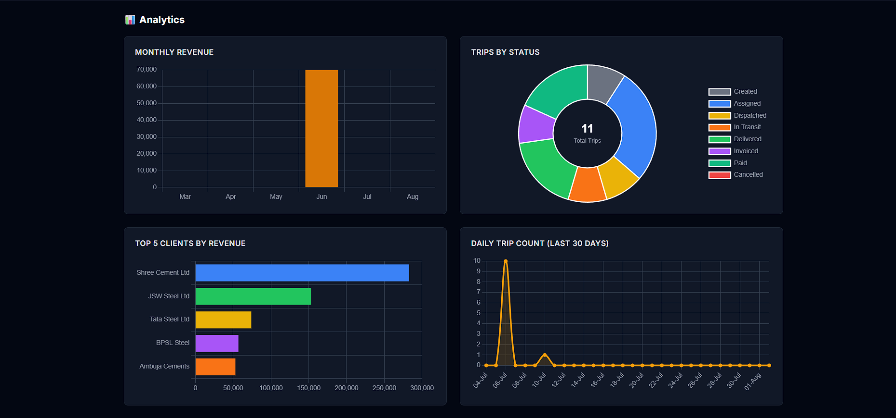
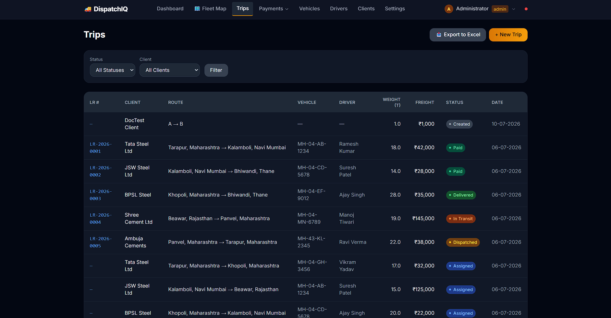
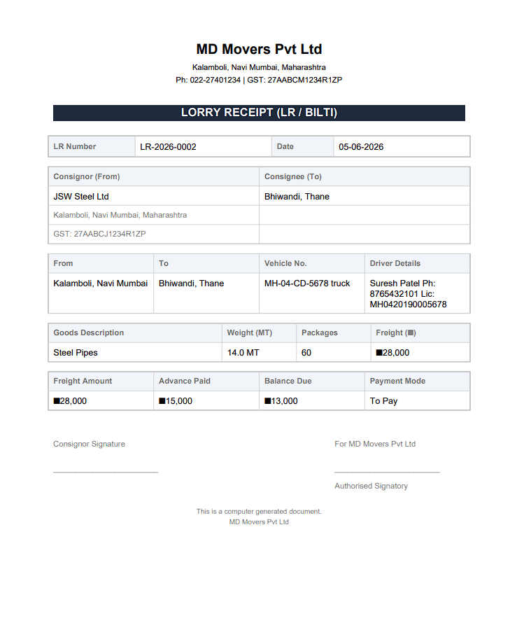

# 🚛 DispatchIQ

**AI-Powered Logistics & Trip Management Platform**


DispatchIQ is a complete dispatch and trip management system built for Indian transport and logistics companies. It replaces manual WhatsApp messages, Excel spreadsheets, and Word document LRs with a single platform. Create trips via AI-powered WhatsApp messages, auto-generate GST-compliant PDFs, and track your fleet live on a map — comparable to commercial solutions costing lakhs per year, but open source and free.

## 📸 Screenshots


*Landing Page of the Website*


*Dashboard with active Trips*


*Dashboard with analytics charts*


*Trip detail page with status progress bar*


*Generated LR PDF*


## ✨ Features

- 🚛 **Trip Management** — Full lifecycle from booking to payment with enforced state machine
- 📄 **Auto LR/Bilti & Invoice** — Professional GST-compliant PDFs generated automatically on dispatch and invoicing
- 💬 **WhatsApp Notifications** — Scan QR once, system auto-sends dispatch/delivery/invoice alerts to clients and drivers
- 🤖 **AI-Powered** — Create trips by sending natural language WhatsApp messages + AI-generated daily fleet summaries (Gemini 2.5 Flash)
- 🗺️ **Live GPS Tracking** — Real-time fleet map with Traccar integration, speed monitoring, and vehicle markers
- 💰 **Payment Tracking** — Record partial/full payments, track client dues, see total receivables at a glance
- 📊 **Analytics Dashboard** — Monthly revenue trends, trip status breakdown, top clients, daily trip count charts
- 📥 **Excel Export** — Download trips, payments, dues, and monthly reports as formatted Excel files
- 🔐 **Role-Based Auth** — Admin, dispatcher, and viewer roles with secure password hashing
- ⚙️ **No-Code Settings** — Configure company details, WhatsApp, GPS, AI — all from web UI, zero file editing
- 🔌 **REST API** — JSON endpoints for all data — ready for mobile app or external system integration
- 🐘 **Database Flexible** — SQLite for development (zero setup), PostgreSQL for production (multi-user)

## 🧱 Tech Stack

| Layer | Technology |
|-------|-----------|
| Backend | Flask (Python 3.11+) |
| Database | SQLite (default) / PostgreSQL (production) |
| Frontend | Jinja2 Templates + Tailwind CSS + Chart.js + Leaflet.js |
| AI/LLM | Google Gemini 2.5 Flash (free tier) |
| WhatsApp | Baileys 7.x (Node.js microservice) |
| PDF Generation | ReportLab |
| Maps | Leaflet.js + CartoDB Dark Tiles |
| GPS Integration | Traccar REST API |
| Authentication | Flask Sessions + Werkzeug Password Hashing |
| Excel Export | openpyxl |

## 🚀 Quick Start (5 minutes)

**Step 1: Clone the repository**

```bash
git clone https://github.com/Ashuytosh/dispatchiq.git
cd dispatchiq
```

**Step 2: Set up Python environment**

```bash
python -m venv venv
```

Windows:

```bash
venv\Scripts\activate
```

Linux/Mac:

```bash
source venv/bin/activate
```

Install dependencies:

```bash
pip install -r requirements.txt
```

**Step 3: Set up WhatsApp service (optional)**

```bash
cd wa-sender
npm install
cd ..
```

**Step 4: Seed test data and run**

```bash
python seed_data.py
python start.py
```

**Step 5: Open in browser**

```
http://localhost:5000
```

Default login:

```
Username: admin
Password: admin123
```

## ⚙️ Configuration

Everything is configured from the web UI at `/settings` — no file editing required.

**Company Details** — Name, address, GST number, phone (used in LR and Invoice PDFs)

**WhatsApp Setup** — Click "Connect WhatsApp" in settings, scan QR code with your phone, select which clients receive notifications

**AI Features** — Paste your Gemini API key in settings to enable AI trip creation via WhatsApp and daily summaries. Get a free key at https://aistudio.google.com/apikeys

**GPS Tracking** — Enter your Traccar server URL and credentials in settings. For testing use demo.traccar.org. Install the Traccar Client app on your phone to test live tracking.

**Database** — SQLite by default (zero setup). For PostgreSQL, create a `.env` file:

```bash
cp .env.example .env
```

Then edit `.env`:

```env
DB_TYPE=postgresql
PG_HOST=localhost
PG_PORT=5432
PG_DBNAME=dispatchiq
PG_USER=postgres
PG_PASSWORD=yourpassword
```

## 🔌 API Endpoints

All API endpoints return JSON. No authentication required for API routes (designed for internal/trusted network use).

| Method | Endpoint | Description |
|--------|----------|-------------|
| GET | `/api/trips` | List all trips (filter: `?status=created&client_id=1`) |
| GET | `/api/trips/{id}` | Single trip with full details |
| POST | `/api/trips` | Create new trip (JSON body) |
| GET | `/api/vehicles` | List all vehicles |
| GET | `/api/vehicles/available` | Only available vehicles |
| GET | `/api/clients` | List all clients |
| GET | `/api/dashboard/stats` | Today's statistics |
| GET | `/api/dashboard/charts` | Analytics chart data (6 months) |
| GET | `/api/map/positions` | All vehicle GPS positions |
| GET | `/api/map/vehicle/{plate}` | Single vehicle GPS position |
| POST | `/api/ai/parse-trip` | Create trip from natural language text |
| POST | `/api/ai/test-summary` | Generate and send daily summary now |
| GET | `/api/whatsapp/status` | WhatsApp connection status |
| GET | `/api/settings/owner-phone` | Get configured owner phone |

## 📁 Project Structure

```
dispatchiq/
├── app.py                          ← Flask app factory + blueprint registration
├── start.py                        ← Single command starts Flask + WhatsApp service
├── run.py                          ← Flask-only entry point
├── seed_data.py                    ← Generate test data (5 clients, 8 vehicles, 10 trips)
├── requirements.txt                ← Python dependencies
├── .env.example                    ← Environment variable template
├── CLAUDE.md                       ← Project conventions for AI-assisted development
│
├── models/                         ← Database layer (queries + schema)
│   ├── database.py                 ← SQLite/PostgreSQL connection + init_db()
│   ├── client.py                   ← Client CRUD
│   ├── vehicle.py                  ← Vehicle CRUD + availability
│   ├── driver.py                   ← Driver CRUD
│   ├── trip.py                     ← Trip CRUD + state machine + stats
│   ├── payment.py                  ← Payment records + client dues
│   ├── user.py                     ← User auth + roles
│   ├── document.py                 ← Generated PDF file tracking
│   └── settings.py                 ← Key-value settings store
│
├── services/                       ← Business logic layer
│   ├── trip_service.py             ← Trip lifecycle + state transitions
│   ├── lr_generator.py             ← LR/Bilti PDF generation (ReportLab)
│   ├── invoice_generator.py        ← GST Invoice PDF generation
│   ├── whatsapp_service.py         ← Send messages via Baileys service
│   ├── ai_parser.py                ← Gemini AI trip parsing from natural language
│   ├── daily_summary.py            ← AI-generated daily fleet summary
│   ├── tracker_service.py          ← Traccar GPS integration
│   ├── analytics_service.py        ← Chart data calculations
│   ├── export_service.py           ← Excel report generation
│   ├── auth.py                     ← Login/role decorators
│   ├── db_service.py               ← DB connection status for Settings page
│   └── scheduler.py                ← Daily summary scheduler (APScheduler)
│
├── routes/                         ← HTTP route handlers (thin controllers)
│   ├── dashboard_routes.py         ← / and /dashboard
│   ├── trip_routes.py              ← /trips/* CRUD + status changes
│   ├── vehicle_routes.py           ← /vehicles/* CRUD
│   ├── driver_routes.py            ← /drivers/* CRUD
│   ├── client_routes.py            ← /clients/* CRUD
│   ├── payment_routes.py           ← /payments/* + dues tracking
│   ├── settings_routes.py          ← /settings configuration UI
│   ├── auth_routes.py              ← /login, /signup, /logout, /profile
│   ├── admin_routes.py             ← /admin/users role management
│   ├── map_routes.py               ← /map fleet tracking
│   └── api_routes.py               ← /api/* JSON endpoints
│
├── templates/                      ← Jinja2 HTML templates
│   ├── base.html                   ← Master layout with nav
│   ├── dashboard.html              ← Stats + charts + active trips
│   ├── landing.html                ← Public landing page
│   ├── settings.html               ← Configuration page
│   ├── trips/                      ← Trip list, create, detail
│   ├── vehicles/                   ← Vehicle list, create, edit
│   ├── drivers/                    ← Driver list, create, edit
│   ├── clients/                    ← Client list, create, edit
│   ├── payments/                   ← Payment list, record, dues
│   ├── auth/                       ← Login, signup, profile
│   ├── admin/                      ← User management
│   ├── map/                        ← Fleet map, vehicle map
│   └── partials/                   ← Reusable badge components
│
├── wa-sender/                      ← WhatsApp microservice (Node.js)
│   ├── index.js                    ← Baileys connection + Express API
│   ├── package.json                ← Node dependencies
│   └── auth_store/                 ← WhatsApp session (gitignored)
│
├── static/
│   ├── documents/                  ← Generated LR and Invoice PDFs
│   └── exports/                    ← Generated Excel reports
│
├── screenshots/                    ← README screenshots
│
├── .claude/                        ← Claude Code configuration
│   ├── specs/                      ← SDD specification documents
│   └── commands/                   ← Custom slash commands (/daily-push, /bug-check)
│
├── Dockerfile                      ← Container config (planned)
├── docker-compose.yml              ← Multi-service deployment (planned)
└── .gitignore                      ← Ignored files
```

## 🔄 Trip Lifecycle

```
CREATED ──→ ASSIGNED ──→ DISPATCHED ──→ IN_TRANSIT ──→ DELIVERED ──→ INVOICED ──→ PAID

Any pre-dispatch status ──→ CANCELLED
```

- **CREATED** — Client request entered
- **ASSIGNED** — Vehicle + driver assigned
- **DISPATCHED** — LR/Bilti PDF auto-generated, WhatsApp alert sent to client
- **IN_TRANSIT** — Vehicle is on the road
- **DELIVERED** — Goods received at destination
- **INVOICED** — GST Invoice PDF auto-generated
- **PAID** — Payment received, trip complete

## 🤖 WhatsApp AI Trip Creation

Send a message to the connected WhatsApp number in natural language:

```
20 ton TMT steel bars Tata Steel Tarapur to Kalamboli warehouse freight 28000
```

The AI parses it and creates a trip automatically, replying with confirmation.

## 🚀 Deployment

**Option 1: Local (Development)**

```bash
python start.py
```

**Option 2: Docker (Production)**

```bash
docker-compose up -d
```

**Option 3: Cloud (Railway/Render)**

- Push to GitHub
- Connect repo on Railway.app or Render.com
- Set environment variables
- Auto-deploys on every push

## 🤝 Contributing

```bash
git checkout -b feature/amazing-feature
```

```bash
git commit -m "Add amazing feature"
```

```bash
git push origin feature/amazing-feature
```

Then open a Pull Request. Follow the conventions in `CLAUDE.md` and run `/bug-check` before submitting.

## 📄 License

MIT License — see [LICENSE](LICENSE) for details. Free to use, modify, and distribute.

## 👨‍💻 Author

**Ashutosh Sahoo**
B.Tech CSE (Data Science) — IIIT Nagpur
GitHub: [Ashuytosh](https://github.com/Ashuytosh)
LinkedIn: [ashutosh-sahoo](https://linkedin.com/in/ashutosh-sahoo)
Built with Claude Code using Spec-Driven Development

---

<p align="center">Built with ❤️ in India | Powered by Flask + Gemini AI</p>
